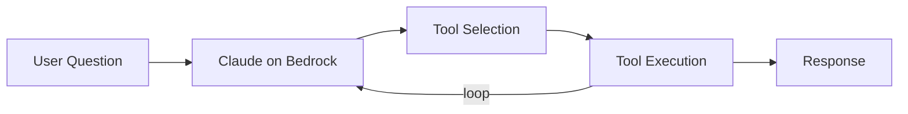
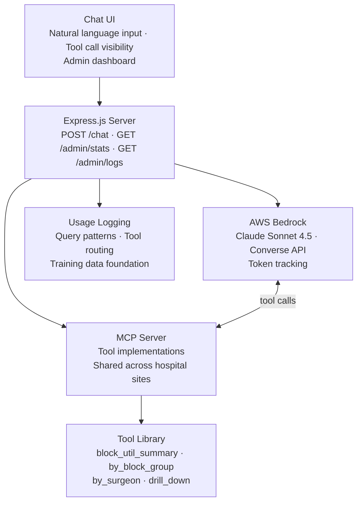

# Case Study: Lumen, LiveData's First AI Product

**Role:** Product Manager (architecture + POC build)
**Stack:** TypeScript, Express.js, AWS Bedrock (Claude Sonnet), MCP Protocol
**Status:** Live in the Insights product as the AI Advisor, running at select commercial hospitals and built on this POC architecture. Engineering is expanding the rollout.

> This is a case study. No proprietary source code or customer data is included. See `NOTICE.md`.

---

## The Problem

LiveData's analytics product gives hospital OR directors access to detailed surgical workflow data — block utilization, first-case-on-time rates, turnover times, cancellation patterns. The data is valuable. The problem is access: extracting a specific insight requires navigating dashboards, selecting the right filters, and knowing which metric to look at in the first place.

Most OR directors don't have time for that. A surgeon asks a question before a block committee meeting. A charge nurse wants to know how their unit is performing. A CSM needs a number to anchor a customer conversation. What they need is to ask a question and get an answer — not a dashboard.

---

## My Role

I defined the architecture and built the proof of concept. Engineering built the production version on that foundation, and it is now live in the Insights product as the AI Advisor at select commercial hospitals. Lumen is LiveData's first AI product.

This is an unusual outcome for a PM: I specced the product, proved the concept in working code, and handed the engineering team something they could build on rather than a requirements document they had to interpret.

---

## What I Built

### Natural Language Interface to OR Data
Perioperative staff can ask plain-language questions and receive immediate, data-backed answers:

- *"Which surgeons have low block utilization this month?"*
- *"How does our FCOTS compare to last quarter?"*
- *"What's the biggest opportunity to improve capacity at this site?"*

### Agentic Tool-Calling Loop
The core of the system is a Claude Sonnet agent running on AWS Bedrock with access to a library of MCP tools. The agent decides which tools to call, calls them with the right parameters, and synthesizes the results into a coherent response — without the user knowing anything about the underlying data structure.

### Multi-Hospital Config System
A single deployment serves hospitals with different data endpoints, different metric definitions, and different available tools. Per-hospital configuration files define which tools are active, which API endpoints to call, and any site-specific rules. Adding a new hospital is a config change, not a code change.

### Dashboard Manifests
Tools are organized into "dashboard manifests" — named collections of tools available for a given context (block utilization review, turnover analysis, surgeon scorecards). This lets the system surface the right capabilities for the right workflow without overwhelming the agent with irrelevant tools.

### Usage Logging (Training Data Foundation)
Every query, tool call, and response is logged. This is deliberately designed for future model training: the logs capture how perioperative staff actually phrase questions, which metrics they ask about together, and what the correct tool routing looks like. As the AI Advisor expands across LiveData's hospital network, that dataset becomes the foundation for the next phase.

### Admin Dashboard
Usage statistics, cost tracking per query, request logs, and error monitoring — giving the team visibility into how the system is being used before it goes to production.

---

## Architecture

---

## The Strategic Insight: Building the Training Data Foundation

The POC isn't just a demo. Every query logs the data needed to train a domain-specific small language model (SLM):

| Phase | What's Happening |
|-------|-----------------|
| **Live (now)** | AI Advisor running at select commercial hospitals. Every query logged. |
| **Expansion** | Rollout across more of LiveData's hospital network. |
| **Analysis** | Query patterns analyzed. SLM training validated. |
| **V2** | Fine-tuned perioperative SLM routes queries; Claude handles reasoning. |

A fine-tuned perioperative model trained on real query patterns from across LiveData's 90+ hospital network (how OR directors phrase questions, which metrics they ask about together, the vocabulary of surgical workflow) would be a dataset competitors would need years to replicate. The AI Advisor logs that data from day one, so the advantage compounds as the rollout expands.

---

## Key Design Decisions

**1. MCP as the tool layer**
Using the Model Context Protocol for tool definitions means tools are reusable across deployments, testable in isolation, and composable with other AI systems — including the internal context engine. It also positions the tool library as a standalone asset the engineering team can extend independently.

**2. Config-driven multi-tenancy**
Architected to serve LiveData's full 90+ hospital network from a single deployment. Site configuration files define what's available where, with no custom code per site. This was a non-negotiable design constraint given the scale of the network.

**3. AWS Bedrock over direct API**
Using Bedrock gives the engineering team a path to enterprise compliance controls, audit logging, and VPC integration that a direct Anthropic API call doesn't. Building on Bedrock from day one meant the production transition didn't require re-architecting the AI layer.

**4. Log everything from the start**
Most POCs don't think about training data. This one was designed with the SLM roadmap in mind — every interaction is an asset, not just a transaction.

---

## Outcomes

- Live in Insights as the AI Advisor at select commercial hospitals, built on the POC architecture I proved out
- LiveData's first AI product: moving from dashboards to natural language queries
- Multi-hospital config system: one deployment scales across sites via config, no per-site code
- Usage logging in place, capturing real perioperative query patterns as the rollout expands
- Foundation laid for a domain-specific SLM trained on real hospital query data

---

More from Chris Eaton, VP of Product at LiveData: [chriseatonai.com](https://chriseatonai.com) &middot; [LinkedIn](https://www.linkedin.com/in/chris-eaton-ai/)
